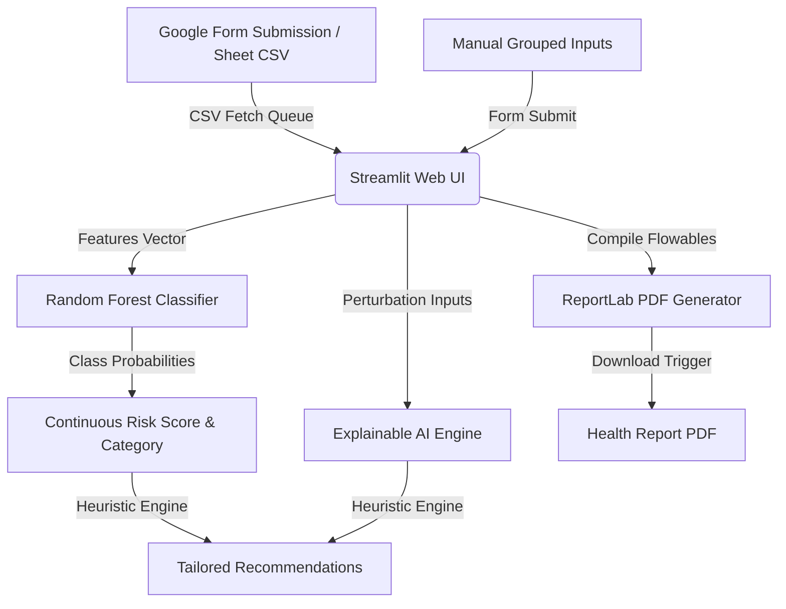

# Health Risk Predictor 🏥

An AI-powered preventive healthcare screening dashboard that predicts cardiovascular and metabolic health risk profiles, imports completed assessments from a linked Google Sheet (intake queue), provides explainable AI local feature importances, and compiles custom clinical PDF reports.

## 🌟 Key Features

1. **🏥 Grouped Health Assessment**: Labeled form fields segmented into *Demographics*, *Clinical Vitals*, and *Lifestyle Profile* sections. Includes validation checks and real-time BMI updates.
2. **📋 Google Form Intake Queue**: Read-only import of submissions from a linked Google Sheet CSV export. Submissions are shown in a queue; clicking "Run Risk Engine" runs them through the ML risk predictor.
3. **📊 Cardiometabolic Insights**:
   - **Vitals Summary**: A row of compact stat cards showing patient BMI, Blood Pressure, Fasting Glucose, and Total Cholesterol directly.
   - **Risk Gauge**: A speedometer-style Plotly gauge chart visualizing risk tiers.
   - **Clear Metric Definitions**: Explanations detailing the difference between Risk Score (ML probability matching) and Algorithm Confidence (classifier certainty).
4. **🥗 Tailored Recommendations**: Diet, exercise, lifestyle, and preventive health guidance based on clinical guidelines.
5. **📥 Downloadable Reports**: Compiles print-ready, letter-size **ReportLab PDFs** complete with patient vitals, risk levels, and recommendations.

---

## 🛠️ Tech Stack

- **Frontend/Dashboard**: Streamlit (v1.58.0)
- **Machine Learning**: Scikit-Learn (v1.9.0) (Random Forest Classifier)
- **Visualization**: Plotly (v6.7.0)
- **Database**: SQLite3 (for storage schema models)
- **PDF Generation**: ReportLab (v4.5.1)

---

## 🏗️ Architecture



---

## 🚀 Setup & Execution

### Prerequisites
Make sure Python 3.10+ is installed on your system.

### Running the Application

1. **Navigate to the project directory**:
   ```bash
   cd C:\Users\bkapa\.gemini\antigravity-ide\scratch\health_risk_predictor
   ```

2. **Run the Streamlit Dashboard**:
   ```bash
   streamlit run app.py
   ```

3. **Check the Google Form Queue**:
   Open the **Google Form Intake Queue** tab and click **Run Risk Engine** on any submission to view the ML prediction insights in real-time.
